<!-- style: ".left-txt {margin-right: -150px;font-size: 32px;}" -->

# Beginner's Guide To   The Linux World!
By Khin (Zin) Wang

<!-- 
簡報原則：

1. 這是一份給完全沒有 Linux 背景知識新手的簡報，內容清晰、容易理解
2. 這是一份可以讓沒用過 Linux 系統的人引起興趣的簡報
3. 這是一份言之有物的簡報
4. 這是一份脈絡清晰的簡報
5. 這是一份品質卓越的簡報

具體作法：

1. 簡報安插與受眾互動環節
   + 以問題引導脈絡
   + 安插小實驗，讓讀者有得忙
   + 安插梗圖

2. 站在受眾角度檢視簡報，補充一切必要（出現在簡報上）之背景知識
   + 善用影片
-->

---

### About Me

+ 資安社前社長
+ 電機大五岩壁仔
+ Linux 長期使用者

---

### 開始之前，先問大家有沒有看過這個畫面

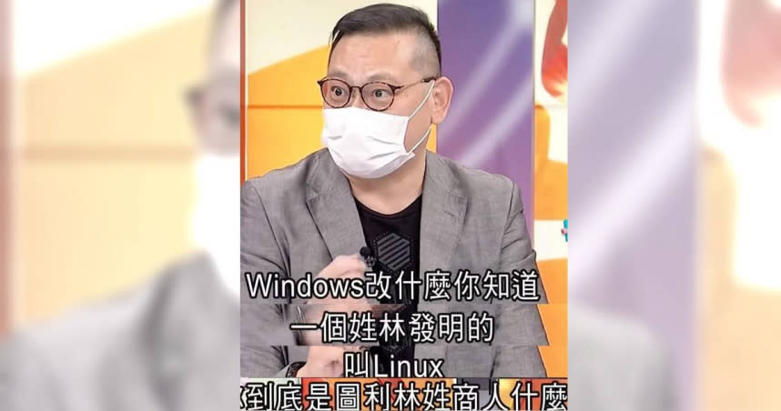

<!--

此圖片目的在於讓大家知道 Linux 不是什麼外星產物，
在台灣社會也會出現對於 Linux 的討論。
但是眼界、知識很重要，片面狹隘的認知只會讓人貽笑大方。

由於評估大部份受眾不會有看過此畫面，
因此不了解此圖片的荒謬，
因此可以先提供客觀描述此畫面之背景（上網搜尋新聞、影片），
等到受眾聽到後面內容後，
就會了解其荒謬。
-->

---

### Outline
1. What Is Linux?
2. Why Linux?
3. How To Start?
4. Let's Play With Ubuntu!

---

# What Is Linux? 😲

---

## 想問大家，出生至今 你用過多少種類的「作業系統」？🙋 

<!-- 

提問：
1. 用過 Windows、MacOS 的舉手～

-->

---

---

### 這其實是一個複雜的[問題](https://csrc.nist.gov/glossary/term/operating_system)

---

### 通俗來說，可以想像作業系統是電腦的靈魂

---

### 作為使用者與電腦硬體之間的橋樑

---

### 讓使用者可以輕鬆使用硬體資源， 卻無需親自[操縱硬體]((https://youtu.be/ACsLvXuaKxw?feature=shared&t=66))

---

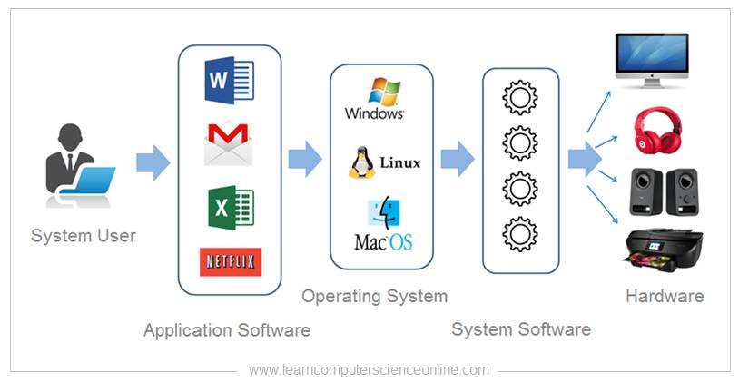

---

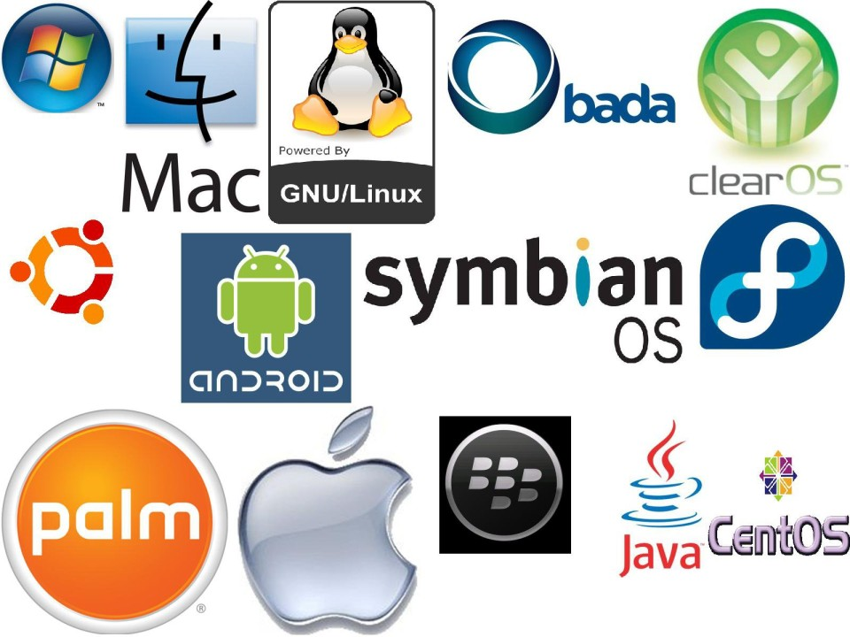

---
### What is Linux?

* Linux 是一種有別於 Windows 與 MacOS 的作業系統

---

### 被廣泛應用於

* 超級電腦：市場佔比 100% (前 500 強超級電腦)
* 伺服器：市場佔比 62.7%
* 手機：市場佔比 73% (Android) 🤔
* 嵌入式設備：市場佔比 38.42%
* 其他種種設備

---
## 例如

---

### [伺服器](https://azure.microsoft.com/en-us/solutions/linux-on-azure)

--- 
### [路由器](https://www.asus.com/tw/networking-iot-servers/wifi-routers/asus-wifi-routers/rt-ac1500g-plus/)
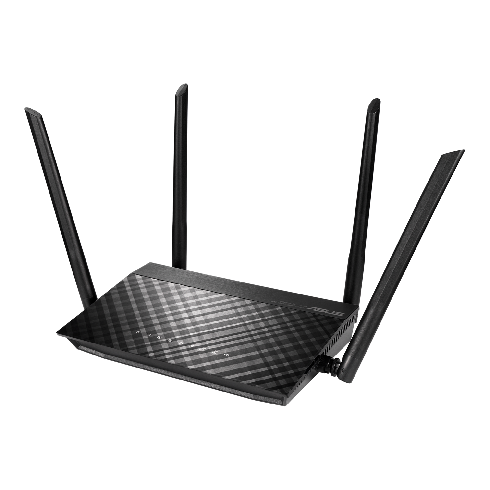

--- 
### [3D 列印機](https://www.raspberrypi.com/success-stories/formlabs-3d-printers/)
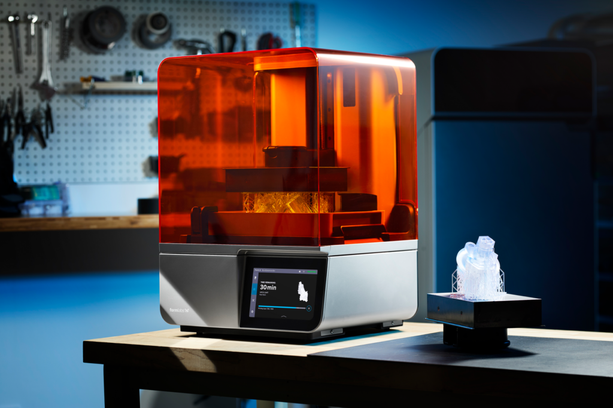

---
### [工業控制器](https://www.raspberrypi.com/success-stories/industrial-shields-plcs/)
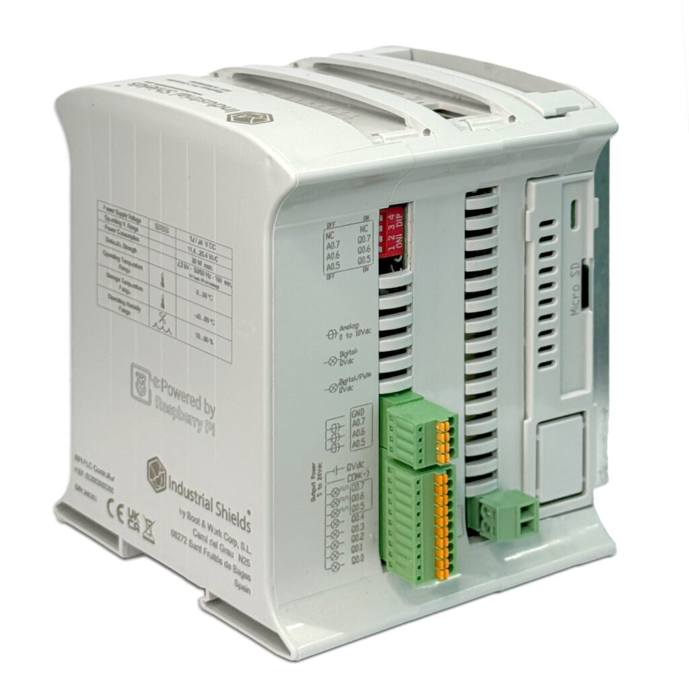

---
### [電子看板](https://mastodon.social/@itsfoss/113843582408089244)
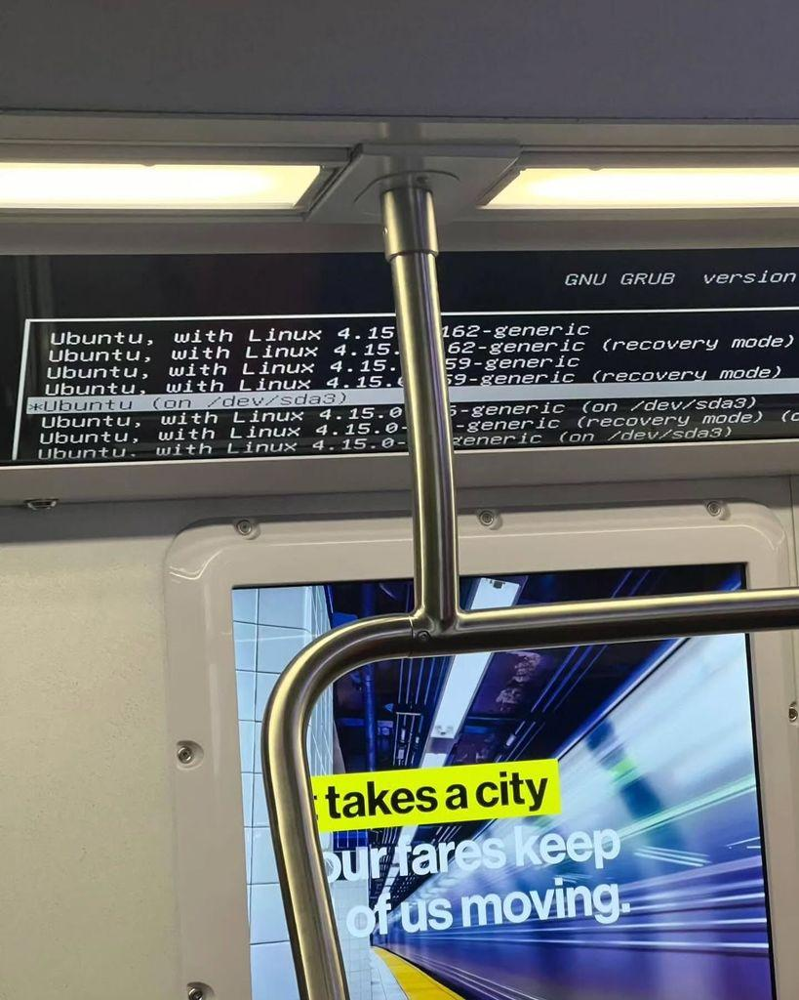

---

### [遊戲機](https://www.steamdeck.com/zh-tw/tech)
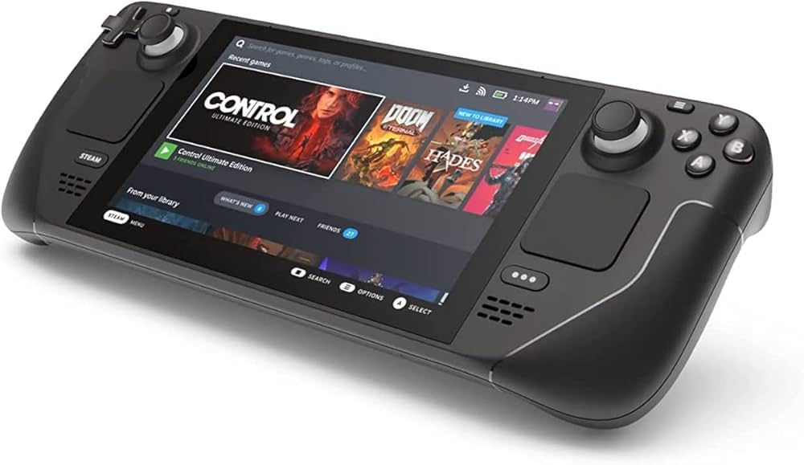

---
### [樹莓派](https://www.raspberrypi.com/)
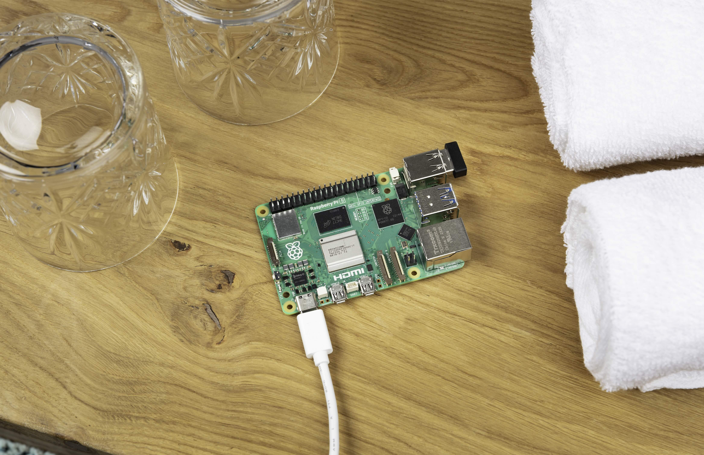

---
### 還有爸爸!!
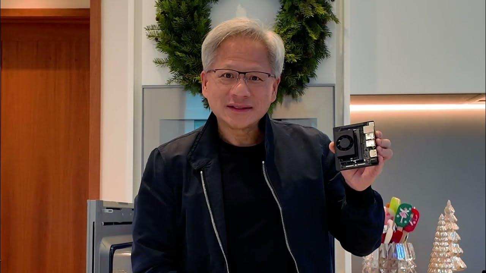

---
### ...手上的   [Jetson Nano](https://www.youtube.com/watch?v=dHvb225Pw1s)
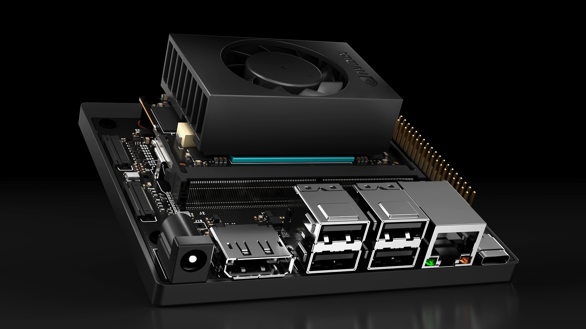

---

### 為什麼 Linux 在 大眾眼裡的存在感這麼低？

---

## [PC 與筆電](https://youtu.be/KFKxlYNfT_o?feature=shared&t=127)：市場佔比 4.1%

---

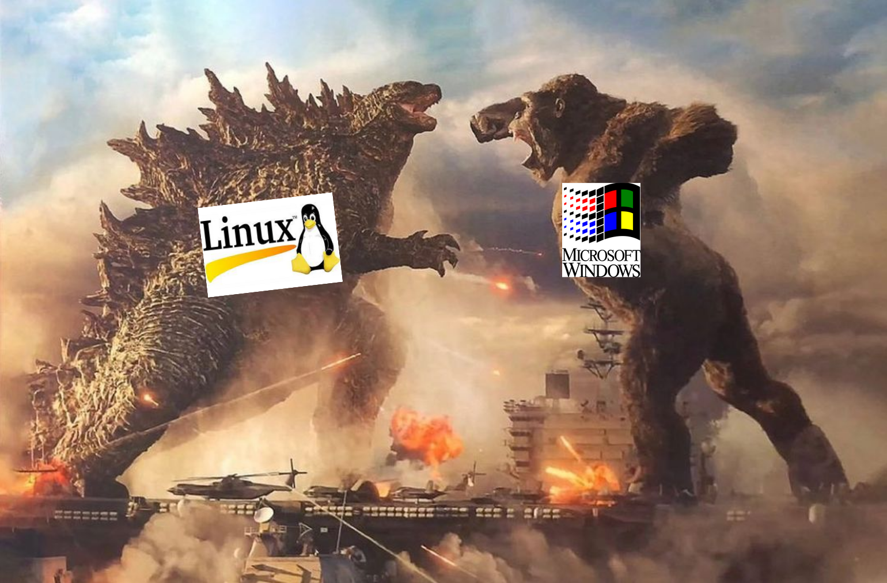

---

### 紀錄片： [作業系統革命](https://www.youtube.com/watch?v=vWwvh3036Fw)
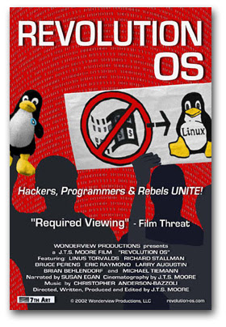

---

## Windows 贏了個人電腦領域，  Linux 則贏了其他

---

---
## Linux 的誕生
---

### 那是一個[專有軟體](https://zh.wikipedia.org/zh-tw/%E4%B8%93%E6%9C%89%E8%BD%AF%E4%BB%B6)稱霸的時代...

---

### 專有軟體代表使用者無法取得原始碼， 沒有權利修改、再散布軟體的權利

---

### 如果你想修改專有軟體程式碼， 修復其中的 Bug ...

---

---

### 如果你想修改專有軟體程式碼， 新增好用功能、 改編成喜歡的樣子...

---

---

### 如果你想使用專有軟體作為基礎， 開發一個工具...

---

---

### 如果你想修改專有軟體程式碼， 將其移植到自己慣用的電腦系統...

---

---

### 當時幾乎所有好用的作業系統都是專有軟體

---

### 更糟糕的是 還大多要錢

---

### 尤其被 AT&T  公司把持的 [UNIX 作業系統](https://zh.wikipedia.org/zh-tw/UNIX)

---

## Linux 之父：   Linus Torvalds

---

### [Linus](https://www.youtube.com/watch?v=vWwvh3036Fw&t=1402s) Torvalds

+ 出生於芬蘭赫爾辛基市
+ 赫爾辛基大學計算機科學系畢業
+ 只用[十天時間](https://www.linux.com/news/10-years-git-interview-git-creator-linus-torvalds/)開發出 [Git](https://zh.wikipedia.org/zh-tw/Git) 的天才
+ [Linux](https://www.youtube.com/watch?v=vWwvh3036Fw&t=1800s) 核心始作俑者

---
### 回顧歷史：最初的開端
[Hello everybody out there using minix](https://groups.google.com/g/comp.os.minix/c/dlNtH7RRrGA/m/SwRavCzVE7gJ)

---

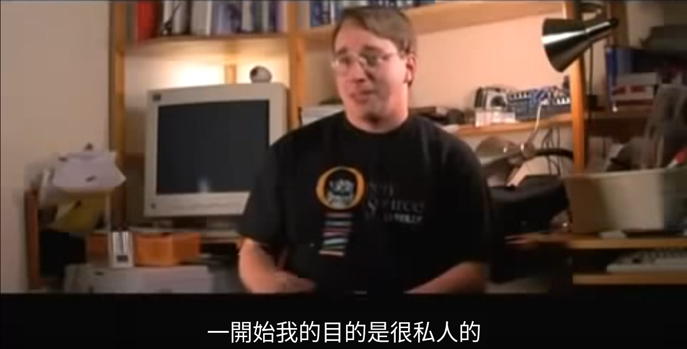

---

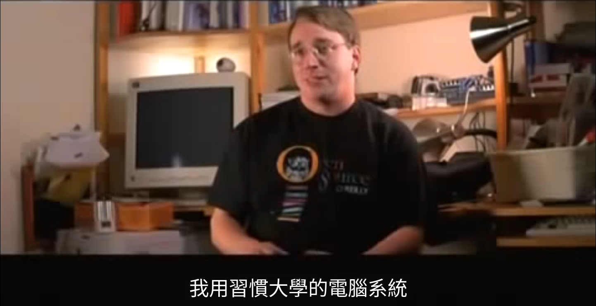

---

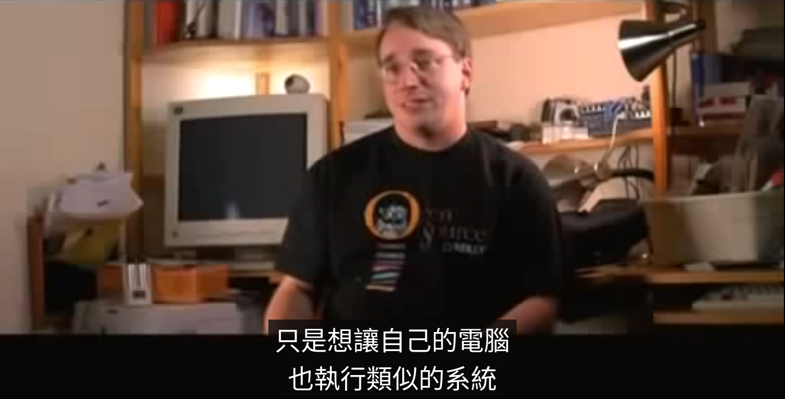

---

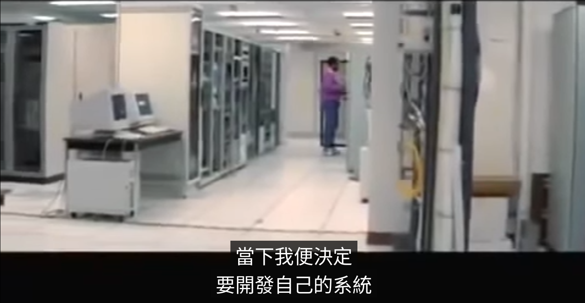

---

---

### 但是技術上來說, Linus 當初開發的「Linux 作業系統」 不等於現今口語說的「Linux 作業系統」

---

---

### Linus 開發的是[作業系統核心](https://zh.wikipedia.org/zh-tw/%E5%86%85%E6%A0%B8)

>  作業系統(核心)唯一的使命就是幫助其它程式執行，
   所以作業系統(核心)從未獨立運行，而僅是默默等待程式
   來向它要求現有資源、某個存在硬碟上的檔案，
   或要求其它程式，將這個程式連接到外面去，
   作業系統(核心)再逐漸地，試著讓人們寫程式容易一些。
   -- Linux Torvalds

---

### 對，也就是資工系的那門[必修課](https://selcrs.nsysu.edu.tw/menu5/showoutline.asp?SYEAR=112&SEM=2&CrsDat=CSE270&Crsname=%E4%BD%9C%E6%A5%AD%E7%B3%BB%E7%B5%B1)

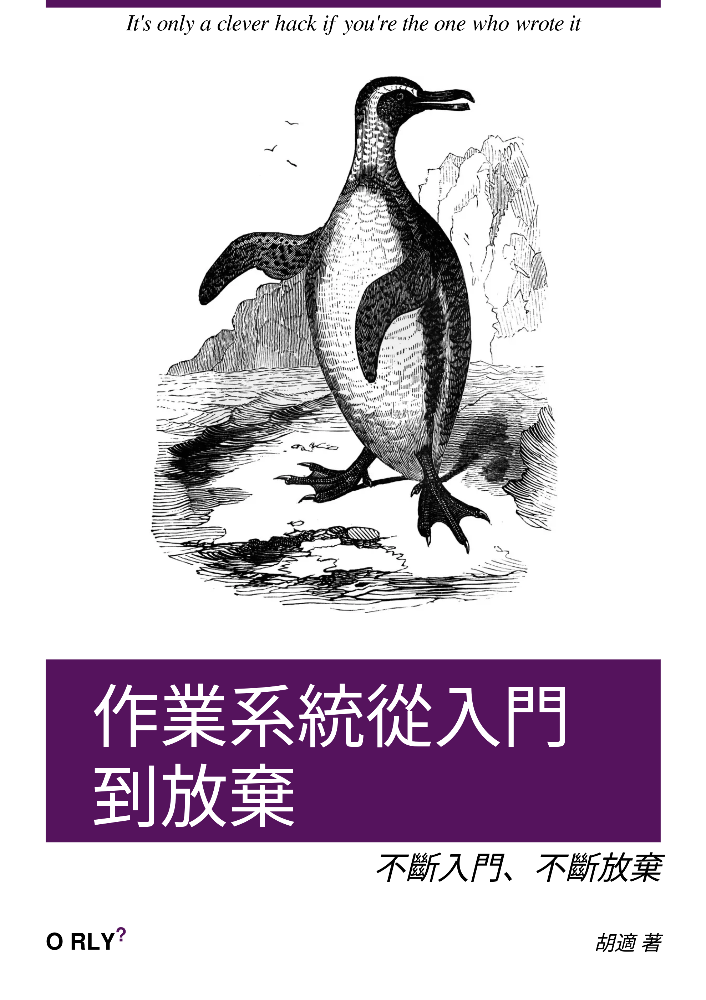

---

## 那我們口語中說的 Linux 系統 又是什麼？

---

## 同一時期大西洋的另一端： GNU 計劃

---
### 自由軟體社群的奮鬥： [GNU 計劃](https://zh.wikipedia.org/zh-tw/GNU%E8%A8%88%E5%8A%83)

+ GNU for GNU's Not Unix
+ 源自於自由軟體基金會
+ 主張公開共享原始碼，任何人都能自由修改、發佈
+ 希望開發出一款自由的作業系統，替代專有 Unix 系統

---

### [四大自由](https://www.gnu.org/philosophy/free-sw.zh-tw.html)

1. 依照你的想法執行該程式的自由，無論任何目的
2. 研究該程式如何運作的自由，並依照你的想法 修改它以符合你的運算所需
3. 再次散布程式副本的自由，如此你就能幫助他人
4. 將你修改過後的版本散布給他人的自由

-- [Richard Stallman](https://zh.wikipedia.org/wiki/%E7%90%86%E6%9F%A5%E5%BE%B7%C2%B7%E6%96%AF%E6%89%98%E6%9B%BC)

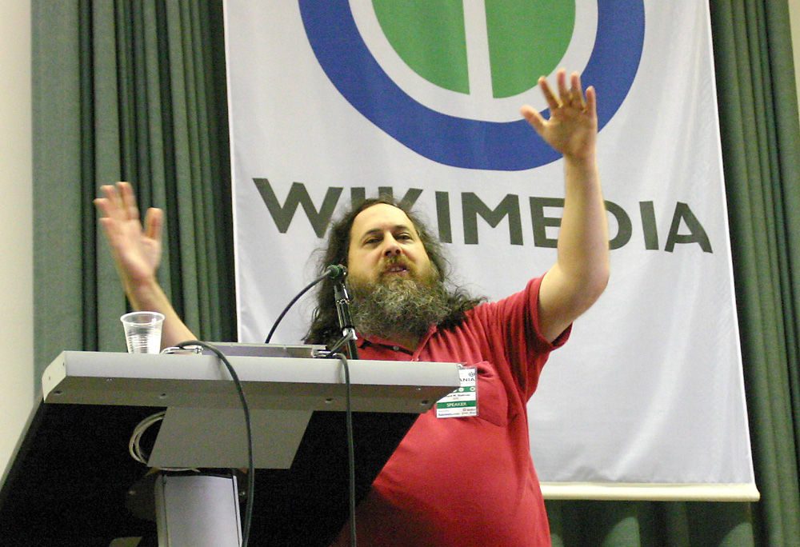

---

### 逐漸地，GNU 計畫開發出UNIX上各種軟體的替代版本

---

## 然而自由軟體社群 卻遭遇一個巨大瓶頸

---

## GNU 的作業系統核心 [Hurd](https://zh.wikipedia.org/zh-tw/GNU_Hurd) 難產 🥶

---

此時隔著大西洋另一岸的某個 21 歲芬蘭大學生剛好寫了一個作業系統核心

---

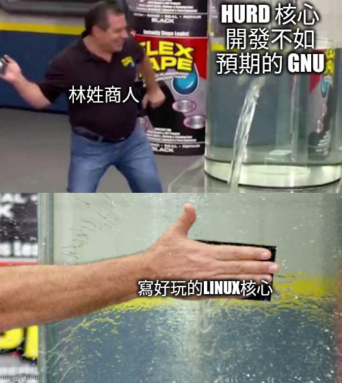

---

## [Just For Fun - Linux Torvalds](https://www.tenlong.com.tw/products/9780066620732)

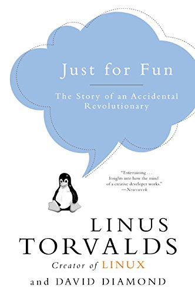

---

## 所以我們口語中說的 Linux 系統

### = 各種軟體 + Linux 作業系統核心

---
### + Linux 作業系統核心

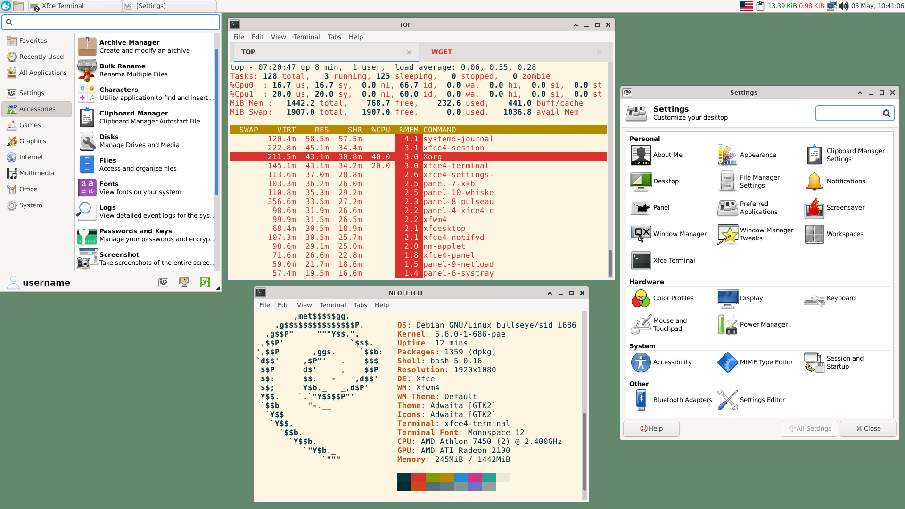

---

### 可以是

GNU 計畫的自由軟體  + Linux 作業系統核心

---

### 也可以是

非 GNU 計畫的其他軟體  + Linux 作業系統核心

---
## 我們都稱為   [Linux 發行版/Linux Distro](https://zh.wikipedia.org/zh-tw/Linux%E5%8F%91%E8%A1%8C%E7%89%88)

---

## [Linux 發行版有那些？](https://upload.wikimedia.org/wikipedia/commons/1/1b/Linux_Distribution_Timeline.svg) 🤷

---

## Debian 家族

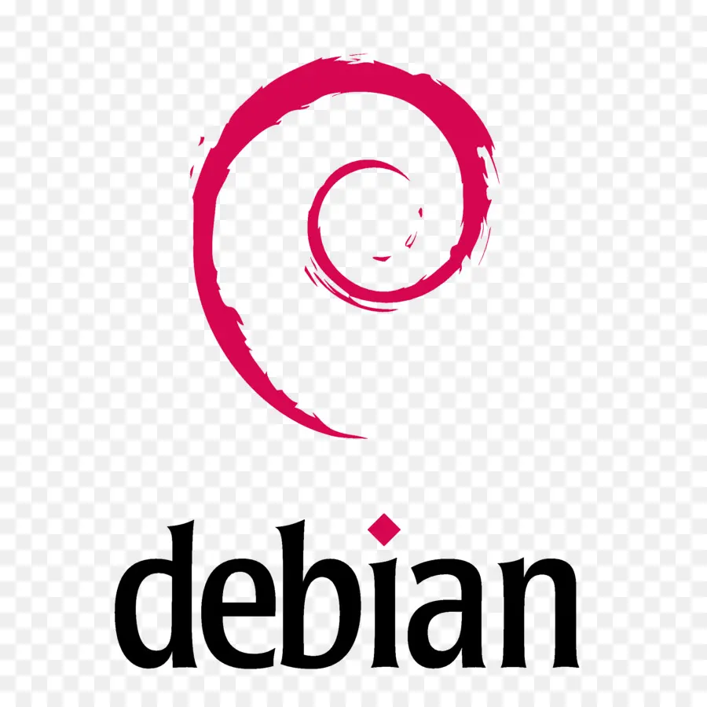
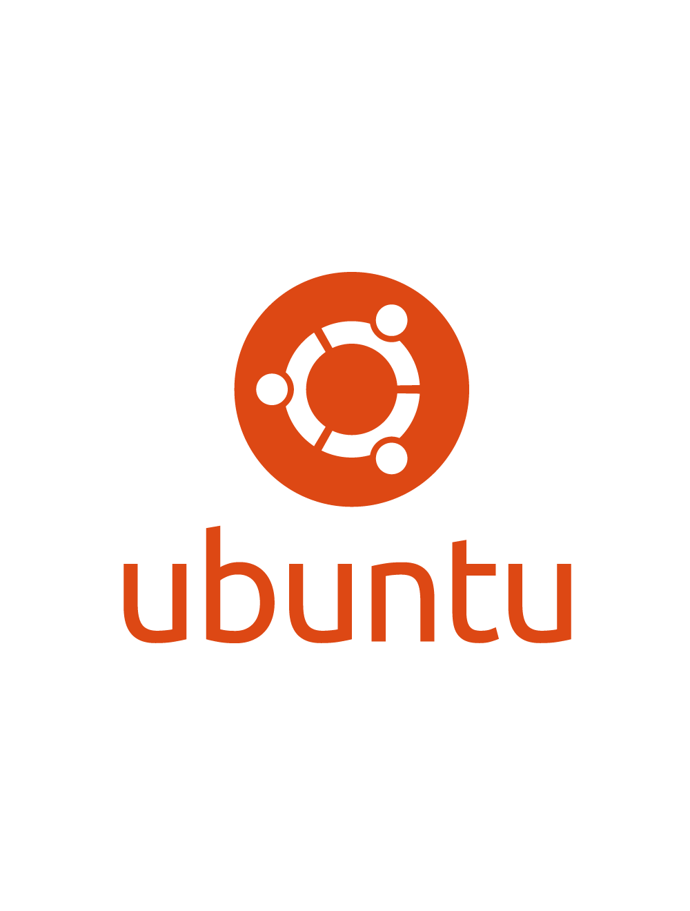

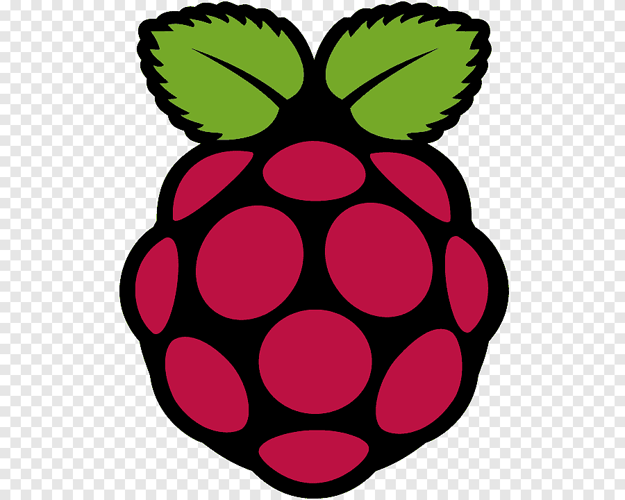
+ [Debian](https://www.debian.org/)
+ [Ubuntu](https://ubuntu.com/)
+ [Mint](https://linuxmint.com/)
+ [Kali Linux](https://www.kali.org/)
+ [Raspberry Pi OS](https://www.raspberrypi.com/software/)
+ ...

---

## Arch 家族

+ [Arch](https://archlinux.tw/)
+ [Manjaro](https://manjaro.org/)
+ [BlackArch](https://blackarch.org/)
+ ...

---

## RedHat 家族

+ [Fedora](https://fedoraproject.org/zh-Hant/)
+ [CentOS](https://www.centos.org/) (已停止開發)
+ [RHEL](https://www.redhat.com/en/technologies/linux-platforms/enterprise-linux) (企業付費版)
+ ...

---

## 其他

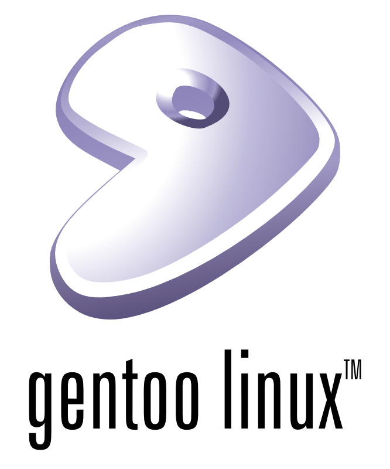
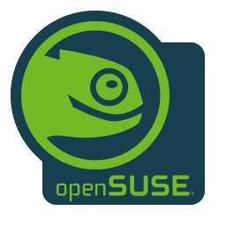

+ [Gentoo](https://www.gentoo.org/)
+ [openSUSE](https://www.opensuse.org/)
+ ...

---

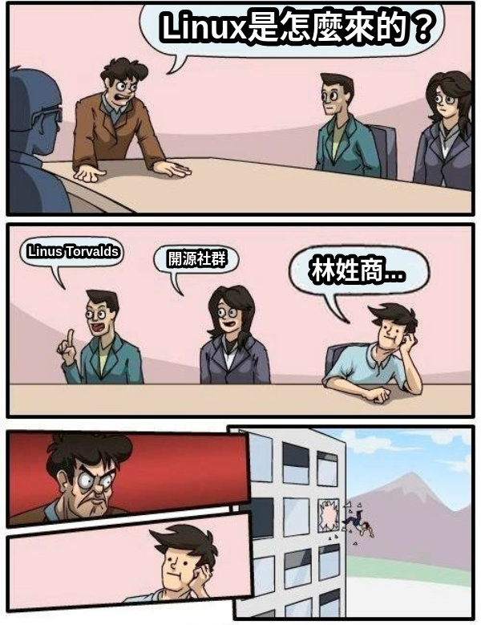

---

## 來不及補充的內容

關於 Linux 與大 Boss 的大戰

---

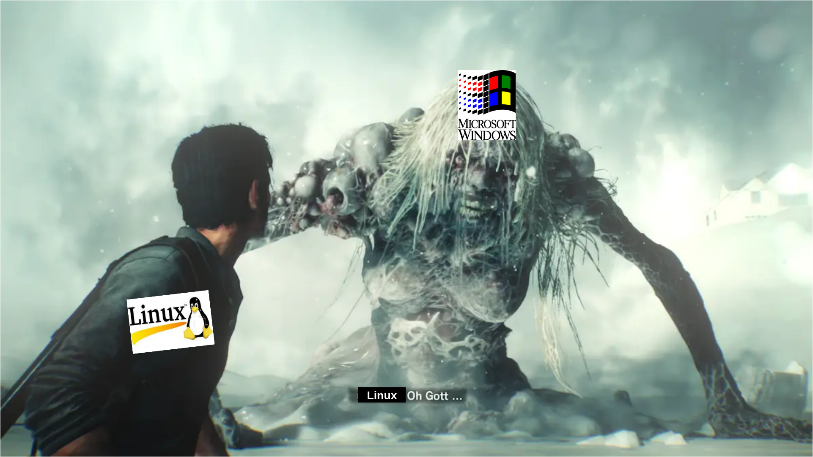

---

### 詳見 [作業系統革命](https://www.youtube.com/watch?v=vWwvh3036Fw)

---

### 關於前面的問題

---

### 為什麼 Linux 在 大眾眼裡的存在感這麼低？

---

## [Linux 本人的回答](https://youtu.be/KFKxlYNfT_o?feature=shared&t=127)

---

# Why Linux? 🤨

---

## 在這之前，我想自我反省一下：   [推廣 Linux 的態度](https://archlinux.tw/getting-started/)

---

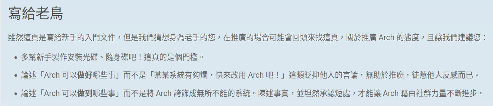

---

## 共勉之 😇

---

### 為什麼使用 Linux? 🤔

1. 大多免費🤩
2. 開放原始碼🙌
3. 自訂程度超高🧑‍🔧
4. 硬體資源需求低💻

---

### 1. 大多免費 🤩

#### 沒錯！ 大部分[發行版](https://upload.wikimedia.org/wikipedia/commons/1/1b/Linux_Distribution_Timeline.svg)都免費， 而且選擇超級無敵多！太幸福了!

---

## 雖然說不健康

---

## 許多使用者(包含我XD) 都會染上換換病 每隔一段時間不換個發行版， 渾身不自在🥵

---

### 2. 開放原始碼 🙌

+ 推陳出新超快，遇到 Bug 修復也超快！
+ 原始碼一切都是公開透明，不怕有人[衝康](https://www.informationsecurity.com.tw/article/article_detail.aspx?aid=11018)！安全有保障！ 
+ 有超龐大的愛好者社群，遇到問題不用怕！新手也免驚！
+ 有超多愛好者奉獻熱情開發並與大家分享，你也可以！

---

### 3. 自訂程度超高 🧑‍🔧

+ 真正感受到，你的電腦是你的電腦！
+ 各種功能都可以按照喜好自訂，讓電腦變成你的形狀！😈
+ Linux 世界裡，沒有什麼是你不能做的！(包含自我毀滅)
+ 遇到問題可親自動手解決，想要什麼功能也能自己來寫！

---

### 假如你不喜歡原本的[桌面環境](https://xtom.com/blog/the-10-best-linux-desktop-environments/)? 換！都換！👍

---

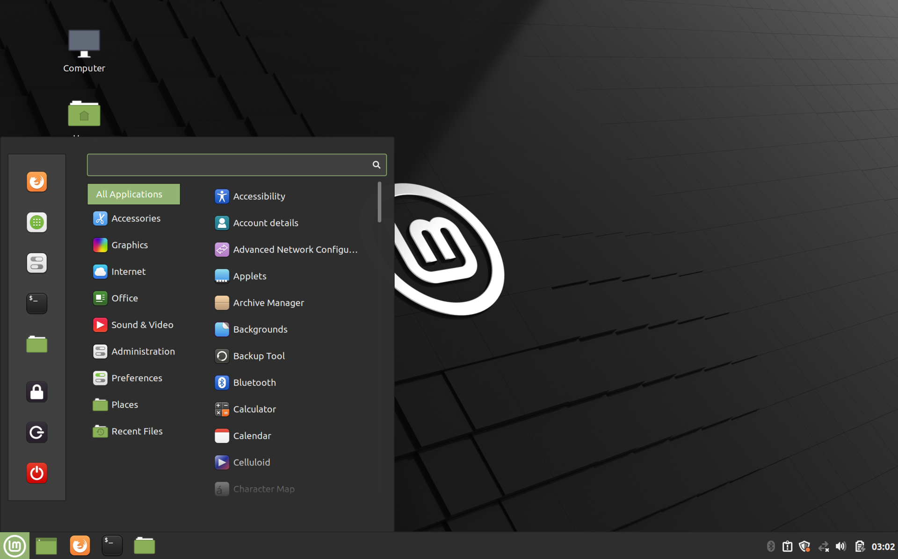
### 這樣

---

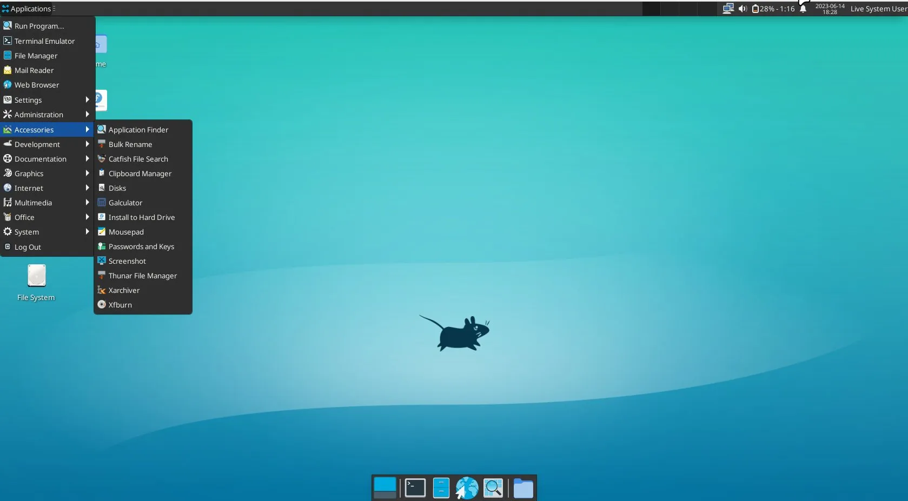
### 這樣

---

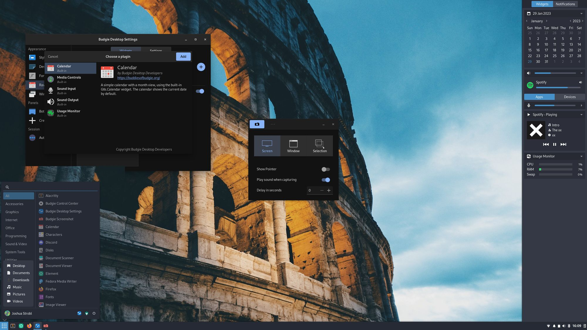
### 還是這樣

---

### 假如你不喜歡原本的[檔案管理器](https://www.tecmint.com/linux-file-managers/)? 換！都換！🤙

---

### 假如你不喜歡原本的[音效伺服器](https://runmodule.com/2021/12/11/linux-sound-servers/)? 換！都換！💪

---

### 4. 硬體資源需求低💻

+ 資源使用效率高，更能發揮電腦性能
+ 適合運行在硬體資源有限之嵌入式、邊緣設備🤖
+ 可以運行在久遠以前的舊電腦

---

### 例子：[大神](https://youtu.be/L8XOqrKBM5w?feature=shared)用一堆蒐集來的老舊設備 運行 Linux，竊聽氣象衛星訊號📡

---

# How To Start?

---

## 階段一：先體驗看看

---

1. 使用 [虛擬機](https://zh.wikipedia.org/zh-tw/%E8%99%9B%E6%93%AC%E6%A9%9F%E5%99%A8) 或 [Live USB](https://zh.wikipedia.org/zh-tw/Live_USB)，在不實際灌系統至電腦的情況下，體驗 Linux 操作

---

### 對於電腦好陌生，好怕弄壞電腦硬碟？
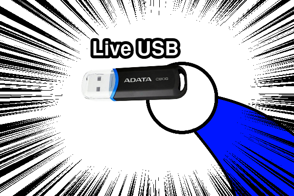

---

2. 先從圖像介面開始，Linux 世界不是只有 駭客電影裡的終端指令

---

3. 體驗 Linux 系統的種種操作，體驗各種自由、開源軟體，上網、聽音樂、畫圖、剪輯照片、玩遊戲、各種用途...

---

## 什麼！你不相信 Linux 可以[玩遊戲](https://www.youtube.com/watch?v=DA5rx7Dw1UI)？

---

## 如果覺得好像可以的話🤔

---

## 階段二：慢慢了解、熟悉操作

---

1. 時不時拿出來把玩一下，不用擔心弄壞電腦

---

2. 利用 Linux 與各種自由、開源軟體做各種用途， 慢慢從做中學

---

3. 學習使用[終端機指令](https://linux.vbird.org/linux_basic/centos7/0220filemanager.php)，更有效率的操作、管理電腦

---

4. 遇到問題，有 ChatGPT 以及官方文件、社群可問，試著自行解決問題

---

## 如果覺得好像可以的話🤔

---

## 階段三：安裝雙系統或直接使用

---

1. 將手上的一台電腦改成 Linux 系統，或安裝雙系統，作為長期慣用系統

---

推薦新手閱讀文章：[Linux 初學者應該知道的事](https://forum.gamer.com.tw/Co.php?bsn=60030&sn=2427798)

--- 

## 心理建設與叮嚀

---

1. 儘管 Linux 有許多功能與 Windows/MacOS 很像，但是 Linux 是 Linux，不要期待所有 Windows 與 MacOS 上的體驗都能移植到 Linux

---

2. 在使用 Linux 的過程中，難免會遇到需要你動手解決的問題，請不要馬上投降，也請冷靜不要慌張，有時只要上網查詢資料，仔細釐清問題本質，通常都能夠找到解法，而且現在有 ChatGPT

---

3. 使用 Linux 遇到問題，上網尋找解法時，不要一股腦兒就實施網路上提供的解法、執行指令，請先：

   + 理解遭遇到的問題本質為何
   + 理解遭遇到的問題本質是否與網路解法的情況相同
   + 理解網路上的解法為什麼可以解決遭遇到的問題
   
    
   如果問題解決記得將解法記錄下來，因為你可能還會遇到

---

4. Linux 是一個非常自由的系統，你能做任何你想做的事，請謹慎使用最高權限，避免鑄下不可逆的錯誤。

---

# Let's Play With Ubuntu!🥳

---

## Virtualbox 虛擬機安裝教學

---

## Windows 使用者看這邊 

---

1. 請先複製資安社隨身碟裡 amd64 目錄夾下的 Ubuntu .iso 檔案至電腦

---

2. 請安裝 Virtualbox 虛擬機 Windows 版，請至[此網站](https://www.virtualbox.org/wiki/Downloads)

---

3. 建立 Ubuntu 虛擬機，請看[這個影片](https://www.youtube.com/watch?v=xnTtF-jJrMQ)

---

## MacOS 使用者看這邊 

---

1. 請先複製資安社隨身碟裡的 Ubuntu .iso 檔案至電腦，如果你的電腦是 M1/M2/M3/M4 晶片，複製 arm 目錄夾底下的檔案，否則複製 amd64 目錄夾底下的檔案

---

2. 請安裝 Virtualbox 虛擬機 MacOS 版，請至[此網站](https://www.virtualbox.org/wiki/Downloads)

---

3. 建立 Ubuntu 虛擬機，請看[這個影片](https://www.youtube.com/watch?v=LjL_N0OZxvY)

---

## Live USB 安裝[教學](https://www.youtube.com/watch?v=i7Uee78td-s)

---

## 最後補充個小知識

---

### Linux 的吉祥物是一隻 企鵝，叫做 Tux

---

### 據說由來是 Linus Torvalds 在澳洲旅遊時，被動物園的一隻企鵝咬了一口

---

## Thank You!

